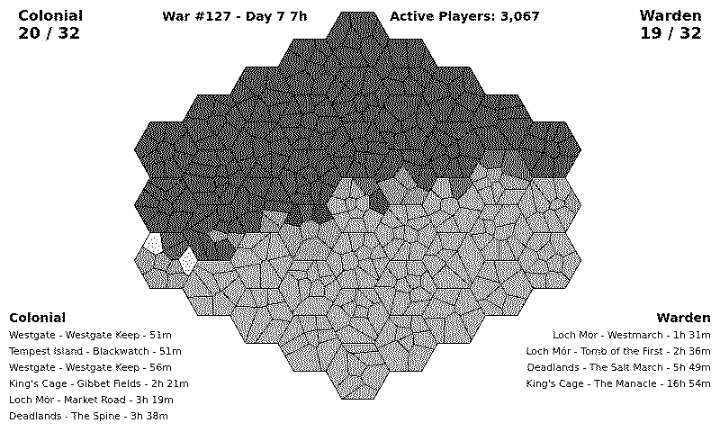
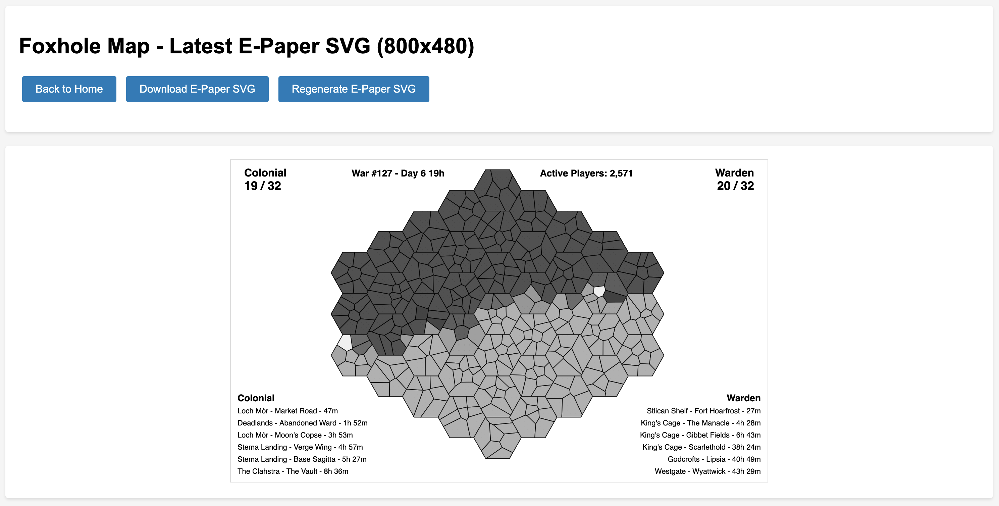

# Foxhole SVG Map Generator

A comprehensive Docker container that generates real-time SVG maps of Foxhole war status, optimized for e-paper displays and Terminus servers. This project provides both a web interface for monitoring war progress and automatic posting to your Terminus device.

## What This Project Does

This project creates beautiful, real-time maps of the Foxhole war by:

- **📊 Tracking War Data**: Monitors town control changes every 5 minutes using the official Foxhole API
- **🗺️ Generating Maps**: Creates high-quality SVG maps with accurate team control visualization
- **📱 E-Paper Ready**: Optimizes maps for small, grayscale displays with high contrast
- **🌐 Web Interface**: Provides a live dashboard to monitor war progress and recent captures
- **📡 Terminus Integration**: Automatically posts updated maps to your Terminus server
- **⏰ Real-Time Updates**: Shows recent town captures with exact timestamps and locations

## Screenshots

### Terminus Dashboard


### Web Interface - War Overview


### Web Interface - Recent Captures


## Features

- **Accurate Sub-region Coloring**: Matches warden.express color logic with proper alpha channels
- **Town Control Tracking**: SQLite database tracks real `lastChange` timestamps
- **Live Data Updates**: Background service updates every 5 minutes
- **E-paper Optimized**: High contrast colors and clear typography for small displays
- **Single Container**: Everything runs in one Docker container
- **Web Interface**: Easy-to-use UI for map generation and monitoring
- **API Endpoints**: Programmatic access to all features
- **Terminus Integration**: Automatic posting to Terminus server with fresh data
- **Recent Captures Display**: Live tracking of town captures with hex and region names

## Why This Project?

- **🎯 E-Paper Focused**: Optimized specifically for small, grayscale displays
- **🔄 Always Fresh Data**: SVG generation automatically uses the latest town control information
- **🚀 Zero Maintenance**: Runs automatically with no manual intervention required
- **📱 Terminus Ready**: Seamlessly integrates with your Terminus server
- **🏗️ Single Container**: Simple deployment with everything in one place
- **📊 Real-Time Monitoring**: Web interface shows live war status and captures

## Quick Start

### 1. Build and Start
```bash
# Start everything (recommended)
make service

# Or build manually
make build
docker-compose up -d
```

### 2. Generate SVG Map
```bash
# Generate and save SVG
make generate

# Download SVG directly
make download

# Use web interface
# Visit http://localhost:3000
```

### 3. Complete Setup
```bash
# One-command setup
make quickstart
```

## Architecture

### Single Container Design
```
foxhole-svg Container:
├── Web Server (port 3000)
│   ├── Web Interface (/)
│   ├── Health Check (/health)
│   ├── API Endpoints (/api/*)
│   └── Static Files
├── Tracking Service (background)
│   ├── Updates every 5 minutes
│   ├── SQLite database
│   ├── Town control tracking
│   └── Triggers Terminus poster
├── SVG Generation (on-demand)
│   ├── GET /api/generate-epaper-svg (download)
│   └── POST /api/generate-epaper-svg (save to file)
└── Terminus Poster Service
    ├── Posts to Terminus server
    ├── Automatically triggered by data updates
    ├── Uses fresh data from tracking service
    └── Creates HTML dashboard with SVG
```

### Data Flow
1. **Data Updater Service** runs every 5 minutes
2. Fetches dynamic map data from Foxhole API
3. Compares current team with stored team
4. Updates `lastChange` timestamp when team changes
5. **Automatically triggers Terminus poster** with fresh data
6. **SVG Generator** reads tracked data
7. Applies alpha channel variation based on `lastChange`
8. **Terminus poster** creates HTML dashboard and posts to server

## Commands

### Service Management
```bash
# Start server with tracking service
make service

# Stop server
make service-stop

# Restart server
make service-restart

# View service logs
make service-logs

# Check health status
make status
```

### SVG Generation
```bash
# Generate and save SVG
make generate

# Download SVG directly
make download

# Quick generation
make svg
```

### Development
```bash
# Open shell in container
make shell

# Run in development mode
make dev

# Test container build
make test
```

### File Operations
```bash
# List generated maps
make list-maps

# Show latest map info
make show-latest

# Backup maps and data
make backup
```

### Cleanup
```bash
# Stop and remove containers
make service-down

# Clean everything
make clean

# Remove everything including volumes
make clean-all
```

### Terminus Server Integration
```bash
# Test Terminus poster service (run once)
make terminus-test
```

**Note**: The Terminus poster service is now integrated into the main service and starts automatically when you run `make service`.

## API Endpoints

When running the web server:

- `GET /` - Web interface
- `GET /health` - Health check
- `POST /api/generate-epaper-svg` - Generate and save e-paper SVG map
- `GET /api/generate-epaper-svg` - Download e-paper SVG map
- `GET /api/conquerStatus` - Get current tracking data
- `GET /api/recent-captures` - Get enriched recent captures data

## Terminus Server Integration

The project automatically posts to your Terminus server whenever fresh Foxhole data is available.

### How It Works

- **Automatic Triggering**: Terminus poster runs automatically after each data update
- **Fresh Data Guaranteed**: SVG always uses the latest town control information
- **Perfect Sync**: No manual scheduling - follows the data updater's 5-minute cycle
- **HTML Dashboard**: Creates beautiful HTML pages with embedded SVG maps

### Setup

1. **Create environment file:**
   ```bash
   cp env.example .env
   # Edit .env with your actual Terminus server details
   ```

2. **Install dependencies:**
   ```bash
   npm install
   ```

3. **Start the main service (includes Terminus poster):**
   ```bash
   make service
   # or
   docker-compose up -d
   ```

### What It Does

- **Waits for fresh data** from the tracking service
- **Generates e-paper SVG** with current war status
- **Creates HTML dashboard** with embedded SVG and war statistics
- **Posts to Terminus server** via REST API
- **Updates existing screen** or creates new one
- **Handles graceful shutdown** and error recovery

### Environment Variables

Create a `.env` file with:
```bash
TERMINUS_URL=https://your-terminus-server.com
DEVICE_API_KEY=your_device_api_key_here
PORT=3000
```

### Testing

Test the Terminus poster independently:
```bash
make terminus-test
```

## Usage Examples

### For E-Paper Display

1. Generate the e-paper SVG:
```bash
make generate-epaper
```

2. Download the e-paper map:
```bash
make download-epaper
```

3. The e-paper SVG is optimized for small displays with:
   - High contrast grayscale colors
   - Clear typography
   - Simplified graphics
   - 800x480 resolution for e-paper devices
   - Recent captures display at the bottom

### Web Interface

Access the web interface at `http://localhost:3000` to:
- View real-time town control data
- Generate and download SVG maps
- Monitor recent captures with hex and region names
- Check service health status

### Automated Updates

The system automatically updates every 5 minutes:
- **Data tracking service** fetches fresh Foxhole data
- **Terminus poster** automatically generates and posts updated maps
- **No manual intervention** required

## Configuration

### Update Interval
Modify `updateInterval` in `src/data-updater.js`:
```javascript
this.updateInterval = 5 * 60 * 1000; // 5 minutes
```

### Database Location
The SQLite database is stored in `data/towns.db`

### Environment Variables
- `PORT` - Server port (default: 3000)
- `NODE_ENV` - Environment mode (default: production)
- `TERMINUS_URL` - Your Terminus server URL
- `DEVICE_API_KEY` - Your Terminus device API key

### Recent Captures Display

The web interface now shows enriched recent captures with:
- **Hex Names**: Converted from region names (e.g., "Basin Sionnach", "Callums Cape")
- **Town Names**: From the tracking database or icon types
- **Capture Times**: Time since each town was captured
- **Team Information**: Colonial vs Warden captures
- **Live Updates**: Refreshes automatically with new data

## Alpha Channel Logic

The system uses the same alpha channel calculation as the main warden.express project:

```javascript
if (timeSinceCapture >= 86400000) { // 24 hours
  alpha = 'BB';
} else {
  const alphaValue = Math.floor(255 - (timeSinceCapture / 86400000) * 68);
  alpha = alphaValue.toString(16).padStart(2, '0');
}
```

This creates visual variation where:
- Recently captured towns have higher alpha (more opaque)
- Towns captured >24 hours ago have lower alpha (more transparent)

## Output

SVG files are saved to the `output/` directory with:
- **E-paper SVG**: `foxhole-map-epaper-2024-01-15T10-30-00-000Z.svg`
- **Latest e-paper**: `latest-epaper.svg`
- **HTML Dashboard**: Automatically posted to Terminus server
- **Database**: Town control data in `data/towns.db`

## Map Features

The generated e-paper SVG includes:
- **Regions**: All 40+ Foxhole hexagonal regions with grayscale patterns
- **Sub-regions**: Voronoi-based sub-regions with accurate team control
- **Team Control**: Grayscale patterns for Colonial vs Warden territories
- **Victory Points**: Current count and required total for war outcome
- **War Information**: War number and duration display
- **Active Players**: Current player count from Steam Charts
- **Recent Captures**: Last 48 hours of town captures with timing
- **E-paper Optimized**: 800x480 resolution with high contrast

## File Structure

```
foxhole-svg/
├── Dockerfile                    # Container definition
├── docker-compose.yml           # Single container setup
├── package.json                 # Dependencies & scripts
├── Makefile                     # Build & management commands
├── src/
│   ├── generate-svg.js          # Main SVG generation logic
│   ├── warapi.js               # Foxhole War API client
│   ├── server-with-tracking.js  # Combined web server + tracking
│   ├── data-updater.js         # Background data tracking service
│   └── database.js             # SQLite database management
├── public/
│   └── static.json             # Static map data
├── output/                      # Generated SVG files
├── data/                        # SQLite database files
└── README.md                    # This file
```

## Technical Details

- **Node.js 20+** runtime
- **Foxhole War API** for live game data
- **SVG generation** optimized for e-paper displays
- **Express.js** web server for API endpoints
- **SQLite** database for town control tracking
- **Docker** containerization for easy deployment

## Troubleshooting

### Service Won't Start
- Check if port 3000 is available
- Verify Foxhole API is accessible
- Check logs: `make service-logs`

### No Alpha Variation
- Ensure tracking service is running
- Check database has data: `make conquer-status`
- Verify town coordinates match between API and database

### Database Issues
- Database is automatically created on first run
- Check `data/towns.db` exists and is writable
- Reset database by deleting `data/towns.db` and restarting service

### Container Issues
- Check container status: `make ps`
- View resource usage: `make stats`
- Restart service: `make service-restart`

## License

Based on the Foxhole Map Annotate project. See original repository for license details.